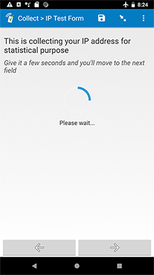

# Get IP address

## Description

This field plug-in obtains the IP address of the device being used to fill out a SurveyCTO form. Once the IP address has been obtained, the form will automatically advance to the next field. You have the option to save either the actual IP address, or a hashed version of it (for enhanced privacy). See the [Parameters section](#parameters) below.

## Default SurveyCTO feature support

| Feature / Property | Support |
| --- | --- |
| Supported field type(s) | `text`|
| Default values | No |
| Custom constraint message | Yes |
| Custom required message | Yes |
| Read only | No |
| media:image | Yes |
| media:audio | Yes |
| media:video | Yes |

## How to use

1. Download the test form [extras/sample-form](https://github.com/surveycto/get-ip-address/raw/master/extras/sample_form/get_ip_address_sample.xlsx) from this repo and upload it to your SurveyCTO server.
1. Download the [table-list.fieldplugin.zip](https://github.com/surveycto/get-ip-address/raw/master/get-ip-address.fieldplugin.zip) file from this repo, and attach it to the test form on your SurveyCTO server.
1. Make sure to provide the correct parameters (see below).

## Parameters

| **Key** | **Value** |
| --- | --- |
| `hash` (optional) | Set this to `yes` to save a 32-bit integer value instead of the actual IP address. |

> **Example:**  
> In the online Form Designer, you can enter `hash="yes"` in the *Plug-in parameters* box. If you are editing this form using a spreadsheet, enter `custom-get-ip-address(hash="yes")` in the *appearance* column.

If no parameters are supplied, the actual IP address will be saved.

## More resources

* **Test form**  
You can find a form definition in this repo here: [extras/sample_form](https://github.com/surveycto/get_ip_address/tree/master/extras/sample_form).

* **Developer documentation**  
More instructions for developing and using field plug-ins can be found here: [https://github.com/surveycto/Field-plug-in-resources](https://github.com/surveycto/Field-plug-in-resources)
